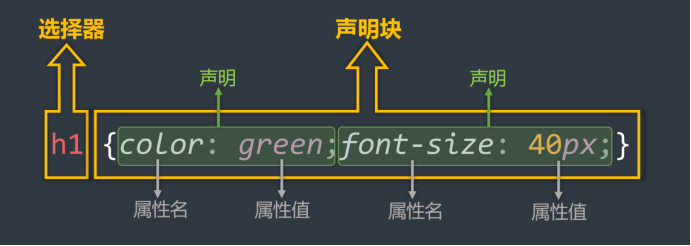

[TOC]

## 一、CSS基础

### 开发者文档
[兼容性](https://caniuse.com/)

| 分类     | 优点                                                                             | 缺点                                             | 使用频率 | 作用范围 |
| -------- | -------------------------------------------------------------------------------- | ------------------------------------------------ | -------- | -------- |
| 行内样式 | 优先级最高                                                                       | 结构与样式未分离<br>代码结构混乱<br>样式不能复用 | 很低     | 当前标签 |
| 内部样式 | 样式可复用<br>代码结构清晰                                                       | 结构与样式未彻底分离<br>样式不能多页面复用       | 一般     | 当前页面 |
| 外部样式 | 样式可多页面复用<br>代码结构清晰<br>可触发浏览器的缓存机制<br>结构与样式彻底分离 | 需要引入才能使用                                 | 最高     | 多个页面 |

### 元素关系

| 关系     | 描述                                         |
| -------- | -------------------------------------------- |
| 父元素   | 直接包裹某个元素的元素，就是该元素的父元素。 |
| 子元素   | 被父元素直接包含的元素。                     |
| 兄弟元素 | 具有相同父元素的元素，互为兄弟元素。         |
| 祖先元素 | 父亲的父亲的父亲……，都是祖先。               |
| 后代元素 | 儿子的儿子的儿子……，都是后代。               |

### 语法规范


**选择器**：找到要添加样式的元素。
**声明块**：设置具体的样式（声明块是由一个或多个声明组成的），

    声明的格式为： 属性名: 属性值;
    声明后加分号
    选择器与声明块之间，属性名与属性值之间，均有一个空格

### 注释规范

    /* 给h1元素添加样式 */
    h1 {
    	/* 设置文字颜色为红色 */
    	color: red;
    	/* 设置文字大小为40px */
    	font-size: 40px
    }

### 代码风格

**展开风格**：开发时推荐，便于维护和调试。
**写法**：

    h1 {
    	color: red;
    	font-size: 40px;
    }

**紧凑风格**：项目上线时推荐，可减小文件体积。
**写法**：`h1{color:red;font-size:40px;}`

## 二、CSS选择器

### 选择器汇总

| 标志  | 选择器类型     | 作用                                   | 写法示例                                                                                                                              |
| ----- | -------------- | -------------------------------------- | ------------------------------------------------------------------------------------------------------------------------------------- |
| *     | 通配选择器     | 选中所有标签，一般用于清除样式。       | `* { color: orange; font-size: 40px; }`                                                                                               |
|       | 元素选择器     | 为某些元素统一设置样式                 | `h1 { color: orange; font-size: 40px; }`<br>`p { color: blue; font-size: 60px; }`                                                     |
| .     | 类选择器       | 选中所有特定类名(class值)的元素        | `.speak { color: red; }`<br>`.answer { color: blue; }`                                                                                |
| #     | ID 选择器      | 选中特定id值的那个元素(唯一的)         | `#earthy { color: red; font-size: 60px; }`                                                                                            |
| A B   | 后代选择器     | 选中指定元素中，符合要求的后代元素     | `ul li { color: red; }`<br>`ul li a { color: orange; }`<br>`.subject li { color: blue; }`<br>`.subject li.front-end { color: blue; }` |
| A > B | 子代选择器     | 选中指定元素中，符合要求的子元素       | `div > a { color: red; }`<br>`.persons > a { color: red; }`                                                                           |
| A + B | 相邻兄弟选择器 | 选中指定元素后，符合条件的相邻兄弟元素 | `div + p { color: red; }`                                                                                                             |
| A ~ B | 通用兄弟选择器 | 选中指定元素后，符合条件的所有兄弟元素 | `div ~ p { color: red; }`                                                                                                             |

### 属性选择器

| 标志          | 选择器类型 | 作用                                           | 写法示例                               |
| ------------- | ---------- | ---------------------------------------------- | -------------------------------------- |
| [attr]        | 属性选择器 | 选中具有某个属性的元素                         | `div[title] { color: red; }`           |
| [attr=value]  | 属性选择器 | 选中包含某个属性，且属性值等于指定值的元素     | `div[title="atguigu"] { color: red; }` |
| [attr^=value] | 属性选择器 | 选中包含某个属性，且属性值以指定的值开头的元素 | `div[title^="a"] { color: red; }`      |
| [attr$=value] | 属性选择器 | 选中包含某个属性，且属性值以指定的值结尾的元素 | `div[title$="u"] { color: red; }`      |
| [attr*=value] | 属性选择器 | 选中包含某个属性，属性值包含指定值的元素       | `div[title*="g"] { color: red; }`      |

### 伪类选择器

| 标志            | 选择器类型 | 作用                               | 写法示例                                  |
| --------------- | ---------- | ---------------------------------- | ----------------------------------------- |
| :link           | 伪类选择器 | 选中超链接未被访问的状态           | `a:link { color: blue; }`                 |
| :visited        | 伪类选择器 | 选中超链接访问过的状态             | `a:visited { color: purple; }`            |
| :hover          | 伪类选择器 | 选中鼠标悬停的状态                 | `a:hover { color: red; }`                 |
| :active         | 伪类选择器 | 选中按下鼠标不松开的状态           | `a:active { color: yellow; }`             |
| :focus          | 伪类选择器 | 选中获取焦点的状态                 | `input:focus { border: 2px solid blue; }` |
| :first-child    | 伪类选择器 | 选中所有兄弟元素中的第一个         | `li:first-child { color: green; }`        |
| :last-child     | 伪类选择器 | 选中所有兄弟元素中的最后一个       | `li:last-child { color: green; }`         |
| :nth-child(n)   | 伪类选择器 | 选中所有兄弟元素中的第 n 个        | `li:nth-child(2) { color: green; }`       |
| :first-of-type  | 伪类选择器 | 选中所有同类型兄弟元素中的第一个   | `p:first-of-type { color: green; }`       |
| :last-of-type   | 伪类选择器 | 选中所有同类型兄弟元素中的最后一个 | `p:last-of-type { color: green; }`        |
| :nth-of-type(n) | 伪类选择器 | 选中所有同类型兄弟元素中的第 n 个  | `p:nth-of-type(2) { color: green; }`      |

### 选择器优先级

!important > 行内样式 > ID选择器 > 类选择器 > 元素选择器 > 通配选择器 > 继承的样式

    行内样式权重大于所有选择器。
    每个选择器，都可计算出一组权重
    !important 的权重，大于行内样式，大于所有选择器

## 三、CSS特性

| 性质   | 作用                                   | 原因       | 解决方式     |
| ------ | -------------------------------------- | ---------- | ------------ |
| 层叠性 | 解决样式冲突                           | 同名不同值 | 后面覆盖前面 |
| 继承性 | 元素自动拥有其父辈元素样式             |            |              |
| 可继承 | text-?? ， font-?? ， line-?? 、 color |            |

## 四、CSS常用属性
| 属性            | 名称          | 属性值                                                            | 举例                                                           | 备注                                                                                                                |
| --------------- | ------------- | ----------------------------------------------------------------- | -------------------------------------------------------------- | ------------------------------------------------------------------------------------------------------------------- |
| color           | 字体颜色      | rgb<br>rgba<br>hsl<br>hsla                                        | -                                                              | IE 浏览器不支持 HEXA ，但支持 HEX<br>色相、饱和度、亮度                                                             |
| font-size       | 字体大小      | px                                                                | -                                                              | Chrome 浏览器支持的最小文字为 12px ，默认的文字大小为 16px ，并且 0px 会自动消失。                                  |
| font-family     | 字体族        | 字体名称                                                          | `div { font-family: "STCaiyun","Microsoft YaHei",sans-serif }` | 可以设置多个字体，按照从左到右的顺序逐个查找                                                                        |
| font-style      | 字体风格      | normal<br>italic<br>oblique                                       | -                                                              | -                                                                                                                   |
| font-weight     | 字体粗细      | lighter（100~300）<br>normal（400~500）<br>bold（600+）<br>bolder | -                                                              | -                                                                                                                   |
| font            | 字体复合写法  | `font: bold 100px '微软雅黑'`                                     | -                                                              | 1. 字体大小、字体族必须都写上。<br>2. 字体族必须是最后一位、字体大小必须是倒数第二位。<br>3. 各个属性间用空格隔开。 |
| letter-spacing  | 文本间距      | px                                                                | -                                                              | -                                                                                                                   |
| text-decoration | 文本修饰      | none<br>underline<br>overline<br>line-through<br>dotted<br>wavy   | -                                                              | -                                                                                                                   |
| text-indent     | 文本缩进      | px                                                                | -                                                              | **作用**：控制文本首字母的缩进                                                                                      |
| text-align      | 文本对齐_水平 | left<br>right<br>center                                           | -                                                              | **作用**：控制文本的水平对齐方式                                                                                    |
| line-height     | 行高          | 像素、百分比、数字（1.5之类的）                                   | -                                                              | **作用**：控制一行文字的高度，控制行与行之间的距离                                                                  |
| vertical-align  | 文本对齐_垂直 | baseline<br>top<br>middle<br>bottom                               | -                                                              | **作用**：用于指定同一行元素之间，或 表格单元格 内文字的 垂直对齐方式<br>**备注**：vertical-align 不能控制块元素    |

### 列表

| CSS属性名           | 功能               | 属性值                                                                                                                                                      |
| ------------------- | ------------------ | ----------------------------------------------------------------------------------------------------------------------------------------------------------- |
| list-style-type     | 设置列表符号       | none:无<br>square:实心方块<br>disc:圆形<br>decimal:数字<br>lower-roman:小写罗马字<br>upper-roman:大写罗马字<br>lower-alpha:小写字母<br>upper-alpha:大写字母 |
| list-style-position | 设置列表符号的位置 | inside : 在li的里面<br>outside:在li的外边                                                                                                                   |
| list-style-image    | 自定义列表符号     | url(图片地址)                                                                                                                                               |
| list-style          | 复合属性           | 没有数量、顺序的要求                                                                                                                                        |

### 边框

| CSS属性名    | 功能         | 属性值                                                                 |
| ------------ | ------------ | ---------------------------------------------------------------------- |
| border-width | 边框宽度     | CSS中可用的长度值                                                      |
| border-color | 边框颜色     | CSs中可用的颜色值                                                      |
| border-style | 边框风格     | none默认值<br>solid实线 <br>dashed虚线<br>dotted点线  <br>double双实线 |
| border       | 边框复合属性 | 没有数量、顺序的要求                                                   |

### 表格

| CSS属性名       | 功能                 | 属性值                                                            |
| --------------- | -------------------- | ----------------------------------------------------------------- |
| table-layout    | 设置列宽度           | auto:自动，列宽根据内容计算(默认值)。<br>fixed:固定列宽，平均分。 |
| border-spacing  | 单元格间距           | CSS中可用的长度值。 <br>生效的前提：单元格边框不能合并。          |
| border-collapse | 合并单元格边框       | collapse:合并  <br>separate:不合并                                |
| empty-cells     | 隐藏没有内容的单元格 | show:显示，默认  <br>hide:隐藏<br>生效前提：单元格不能合并。      |
| caption-side    | 设置表格标题位置     | top:上面(默认值)  <br>bottom:在表格下面                           |

### 背景

| css属性名           | 功能                         | 属性值                                                                                                                                                                                                                                                                                                                                                                                           |
| ------------------- | ---------------------------- | ------------------------------------------------------------------------------------------------------------------------------------------------------------------------------------------------------------------------------------------------------------------------------------------------------------------------------------------------------------------------------------------------ |
| background-color    | 设置背景颜色                 | 符合cSS中颜色规范的值。  <br>  <br>默认背景颜色是transparent。                                                                                                                                                                                                                                                                                                                                   |
| background-image    | 设置背景图片                 | url(图片的地址)                                                                                                                                                                                                                                                                                                                                                                                  |
| background-repeat   | 设置背景重复方  <br>  <br>式 | repeat:重复，铺满整个元素，默认值。  <br>  <br>repeat-x:只在水平方向重复。  <br>  <br>repeat-y:只在垂直方向重复。  <br>  <br>no-repeat:不重复。                                                                                                                                                                                                                                                  |
| background-position | 设置背景图位置               | 通过关键字设置位置：  <br>写两个值，用空格隔开  <br>  <br>水 平 ：left、center、right  <br>  <br>垂 直 ：top、center、bottom  <br>  <br>如果只写一个值，另一个方向的值取center  <br>  <br>  <br>通过长度指定坐标位置：  <br>  <br>以元素左上角，为坐标原点，设置图片左上角的  <br>位置。  <br>  <br>两个值，分别是x坐标和y坐标。  <br>  <br>只写一个值，会被当做x坐标，y坐标取  <br>  <br>center |
| background          | 复合属性                     | 没有数量和顺序要求                                                                                                                                                                                                                                                                                                                                                                               |

### 鼠标

| CSS属性名 | 功能               | 属性值                                                                                                    |
| --------- | ------------------ | --------------------------------------------------------------------------------------------------------- |
| Cursor    | 设置鼠标光标的样式 | pointer  小手  <br>move:移动图标  <br>text:文字选择器  <br>crosshair:十字架  <br>wait:等待  <br>help:帮助 |

## 五、盒子模型

### 长度

| 单位 | 名称                           |
| ---- | ------------------------------ |
| px   | 像素                           |
| em   | 相对元素 font-size 的倍数      |
| rem  | 相对根字体大小，html标签就是根 |
| %    | 相对父元素计算                 |

### 显示模式（display）

|            |              |                                                                                                                                                                                                                             |
| ---------- | ------------ | --------------------------------------------------------------------------------------------------------------------------------------------------------------------------------------------------------------------------- |
| 块元素     | block        | \<html> 、 \<body><br>\<h1> \~ \<h6> 、 \<hr> 、 \<p> 、 \<pre> 、 \<div><br>\<ul> 、 \<ol> 、 \<li> 、 \<dl> 、 \<dt> 、 \<dd><br>\<table> 、 \<tbody> 、 \<thead> 、 \<tfoot> 、 \<tr> 、\<caption><br>\<form>、\<option> |
| 行内元素   | inline       | \<br> 、 \<em> 、 \<strong> 、 \<sup> 、 \<sub> 、 \<del> 、 \<ins>、\<a> 、 \<label>                                                                                                                                       |
| 行内块元素 | inline-block | \  、\<td> 、 \<th>  、\<input> 、 \<textarea> 、 \<select> 、 \<button>、\<iframe>                                                                                                                                    |

    行内元素无法设置宽高
    行内块可以

### 盒子组成


|        |         |                                    |                                                                                         |
| ------ | ------- | ---------------------------------- | --------------------------------------------------------------------------------------- |
| 外边距 | margin  | 盒子与外界的距离                   | margin-top<br>margin-right<br>margin-bottom<br>margin-left                              |
| 边框   | border  | 盒子的边框                         | none ： 默认值<br>solid ： 实线<br>dashed ： 虚线<br>dotted ： 点线<br>double ： 双实线 |
| 内边距 | padding | 紧贴内容的补白区域                 | padding-top<br>padding-right<br>padding-bottom<br> padding-left                         |
| 内容   | content | 元素中的文本或后代元素都是它的内容 |                                                                                         |

    上右下左
    padding不负
    margin可负
    行内margin无上下

### overflow

|            |                              |                                                                                                                             |
| ---------- | ---------------------------- | --------------------------------------------------------------------------------------------------------------------------- |
| overflow   | 溢出内容的处理方式           | visible ：显示，默认值<br>hidden ：隐藏<br>scroll ：显示滚动条，不论内容是否溢出<br>auto ：自动显示滚动条，内容不溢出不显示 |
| overflow-x | 水平方向溢出内容的处理方式   |                                                                                                                             |
| overflow-y | 垂直方向溢出内容给的处理方式 |                                                                                                                             |

### 新增属性

| 属性    | 名称 | 解释                                                                                 |
| ------- | ---- | ------------------------------------------------------------------------------------ |
| rem     | rem  | 根元素字体大小的倍数，通常用于响应式设计，使页面元素大小随根元素字体大小变化而变化。 |
| vw      | vw   | 视口宽度的百分比，1vw 等于视口宽度的 1%。                                            |
| vh      | vh   | 视口高度的百分比，1vh 等于视口高度的 1%。                                            |
| vmax    | vmax | 视口的较大值（宽度或高度）的百分比，1vmax 等于视口的较大值的 1%。                    |
| vmin    | vmin | 视口的较小值（宽度或高度）的百分比，1vmin 等于视口的较小值的 1%。                    |
| opacity |      | 透明度                                                                               |

#### resize

| 属性       | 名称                     | 解释                                           |
| ---------- | ------------------------ | ---------------------------------------------- |
| none       | 不允许调整大小           | 用户不能调整元素的尺寸。                       |
| both       | 水平和垂直方向都可以调整 | 用户可以同时在水平和垂直方向上调整元素的尺寸。 |
| horizontal | 仅水平方向调整           | 用户只能在水平方向上调整元素的尺寸。           |
| vertical   | 仅垂直方向调整           | 用户只能在垂直方向上调整元素的尺寸。           |

#### box-shadow
| 属性          | 名称           | 解释                                           |
| ------------- | -------------- | ---------------------------------------------- |
| h-shadow      | 水平阴影偏移量 | 阴影在水平方向上的偏移量，正值向右，负值向左。 |
| v-shadow      | 垂直阴影偏移量 | 阴影在垂直方向上的偏移量，正值向下，负值向上。 |
| blur-radius   | 模糊半径       | 阴影的模糊程度，值越大越模糊。                 |
| spread-radius | 扩展半径       | 阴影的扩展或收缩，正值扩大阴影，负值缩小阴影。 |
| color         | 阴影颜色       | 阴影的颜色，可以使用任何有效的 CSS 颜色值。    |

#### background-origin

| 属性        | 名称   | 解释                                   |
| ----------- | ------ | -------------------------------------- |
| padding-box | 填充区 | 背景图像从填充区开始绘制。这是默认值。 |
| border-box  | 边框区 | 背景图像从边框区开始绘制。             |
| content-box | 内容区 | 背景图像从内容区开始绘制。             |

#### background-clip

| 属性        | 名称   | 解释                             |
| ----------- | ------ | -------------------------------- |
| border-box  | 边框区 | 背景被裁剪到边框区。这是默认值。 |
| padding-box | 填充区 | 背景被裁剪到填充区。             |
| content-box | 内容区 | 背景被裁剪到内容区。             |

#### background-size

| 属性       | 名称     | 解释                                                       |
| ---------- | -------- | ---------------------------------------------------------- |
| auto       | 自动     | 背景图像按其原始尺寸显示。这是默认值。                     |
| length     | 固定大小 | 通过指定宽度和高度来设置背景图像的大小。                   |
| percentage | 百分比   | 通过指定相对于容器宽度和高度的百分比来设置背景图像的大小。 |
| cover      | 覆盖     | 背景图像将被缩放以完全覆盖背景区域，可能会裁剪部分图像。   |
| contain    | 包含     | 背景图像将被缩放以适应背景区域，不会裁剪图像。             |

### 文本溢出

```
  // 超出部分隐藏
  overflow: hidden;
  // 超出部分显示省略号
  text-overflow: ellipsis;
  // 文本不换行
  white-space: nowrap;
```

### 渐变色

