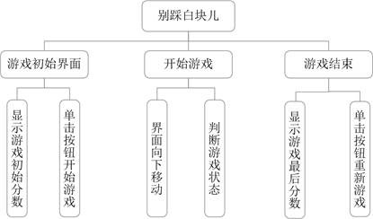
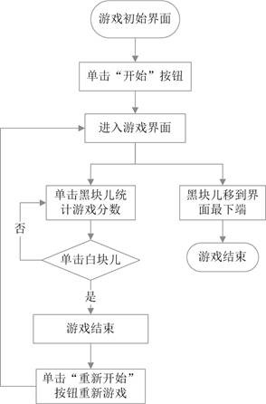
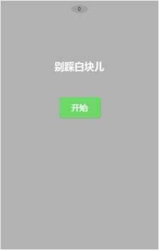
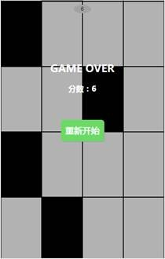
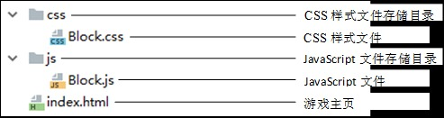

# 开发准备
## 开发背景

《别踩白块儿》最初是由Umoni Studio制作的一款休闲益智游戏。该游戏于2014年4月16日上线App Store。游戏上线后，在全球40多个国家和地区的免费游戏榜中登顶榜首，上线3个月累计下载量达1亿，由此可见该游戏的受欢迎程度。本章将通过JavaScript脚本语言来模拟这个小游戏。

## 系统功能结构

游戏功能结构图如图1所示。

图1 功能结构图

## 系统业务流程

游戏业务流程图如图2所示。

图2 业务流程图

## 系统预览

《别踩白块儿》小游戏的页面效果如下所示。

l 游戏初始界面

游戏初始界面主要用于显示游戏的名称、游戏初始分数和“开始”按钮。页面效果如图3所示。

图3 游戏初始界面

l 游戏进行中界面

单击“开始”按钮开始游戏，游戏开始后，界面中的黑块儿会向下移动，单击黑块儿可以统计游戏分数。游戏进行中的页面效果如图4所示。

图4 游戏进行中

l 游戏结束界面

在游戏过程中，如果单击了游戏界面中的白块儿，或者黑块儿移动到界面的最下端就表示游戏结束。游戏结束的页面效果如图5所示。

图5 游戏结束

## 项目目录结构预览

程序的目录结构图如图6所示。

图6  项目目录结构图

 # 创建项目

其中itme.flag的格式为
flag: "项目管理 ，资源优化 ，成本控制 ，供应链管理"

请将flag字段中的文字以“，”为界分割开