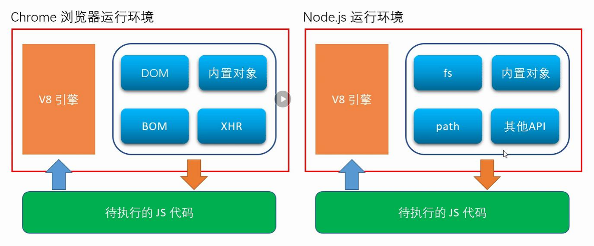
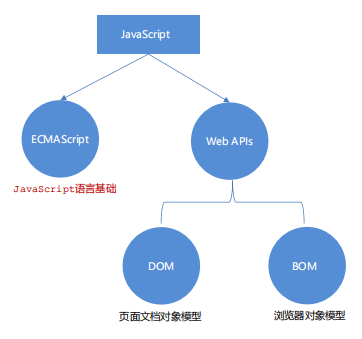

[TOC]

## 一、入门

### JavaScript是什么

JavaScript 是一种脚本语言，是一种动态语言，是一种解释型语言，是一种弱类型语言，是一种跨平台语言

### JavaScript可以做什么

- 网页特效 (监听用户的一些行为让网页作出对应的反馈) 
- 表单验证 (针对表单数据的合法性进行判断)
- 数据交互 (获取后台的数据, 渲染到前端) 
- 服务端编程 (node.js)

### JavaScript分为哪个几部分




- ECMAScript（规定了js基础语法核心知识）
- DOM（操作文档）
- BOM（操作浏览器）

## 二、语法

### 基本概念

| 名称             | 作用                           |
| ---------------- | ------------------------------ |
| 变量          | 变量是存储数据的容器                     |
| 数组       |  存储多个数据的容器                     |
| const | 常量，不允许重新赋值                     |
| let  | 块级作用域，只在{}中有效，不支持重名       |
| var  | 全局作用域，支持重名，不建议使用           |


### 数据类型

- 基本数据类型
  - number 数字型
  - string 字符串型
  - boolean 布尔型
  - undefined 未定义型
  - null 空类型
- 引用数据类型
  - Object


### 报错信息


常量不允许重新赋值

### 变量

命名规则

### 常用语句

| 语句             | 功能                           |
| ---------------- | ------------------------------ |
| alert()          | 弹出对话框                     |
| console.log()    | 打印到控制台                   |
| prompt()         | 弹出对话框，返回用户输入的值   |
| confirm()        | 弹出对话框，返回用户点击的按钮 |
| setInterval()    | 定时器                         |
| setTimeout()     | 定时器                         |
| document.write() | 向页面写入内容                 |


### boolean类型转换

| 数据类型 | true       | false  |
| -------- | ---------- | ------ |
| boolean  | true       | false  |
| string   | 非空字符串 | 空     |
| number   | 非零数值   | 0、NaN |

### 注意事项

1. 严格区分大小写
2. 空格、换行、缩进不敏感
3. 分号可省略

### 引入

async 异步加载
defer 延迟加载


## 三、数组

### 1.创建数组

#### 使用new Array() 创建数组

```
  // 元素值类型为字符型
  var area = new Array('Beijing', 'Shanghai', 'Shenzhen');
  // 元素值类型为数值型
  var score = new Array(56, 68, 98, 44);
  // 元素值类型为混合型
  var mix = new Array(123, 'abc', null, true, undefined);
  // 空数组
  var arr1 = new Array();  // 或 var arr2 = new Array;
```

#### 使用 [ ] 创建数组

```
var weather = ['wind', 'fine',];      // 相当于：new Array('wind', 'fine',)
var empty = [];                       // 相当于：new Array
var mood = ['sad', , , ,'happy'];     // 控制台输出mood：(5) ["sad", empty × 3, "happy"]
```

### 2.操作数组
#### 获取数组长度
使用.length

```
var arr1 = [78, 88, 98];
var arr2 = ['a', , , , 'b', 'c'];
console.log(arr1.length);   // 输出结果为：3
console.log(arr2.length);   // 输出结果为：6
```

#### 设置数组长度
使用.length并初始化
大于留空
小于删除
 
```
var arr1 = [];
arr1.length = 5;
console.log(arr1);      // 输出结果：(5) [empty × 5]
var arr2 = [1, 2, 3];
arr2.length = 4; 
console.log(arr2);      // 输出结果：(4) [1, 2, 3, empty]
var arr3 = ['a', 'b'];
arr3.length = 2; 
console.log(arr3);      // 输出结果：(2) ["a", "b"]
var arr4 = ['hehe', 'xixi', 'gugu', 'jiujiu'];
arr4.length = 3; 
console.log(arr4);      // 输出结果：(3) ["hehe", "xixi", "gugu"]
```

#### 遍历数组
for in 循环
```
var navlistArr = ['首页','新闻','关于'];
var str = '<ul>';
for(var i in navlistArr){
    str += '<li><a>'+ navlistArr[i] +'</a></li>';
}
str += '</ul>';
document.getElementById('navlist').innerHTML = str;
```

### 3.操作元素

使用 数组名\[下标]的方式

#### 增加元素

```
// 为空数组添加元素
var height = [];
height[5] =  183;
height[0] =  175;
height[3] =  150;
console.log(height);      // 输出结果：(6) [175, empty × 2, 150, empty, 183]

// 为非空数组添加元素
var arr = ['Asa', 'Taylor'];
arr[2] = 'Tom';
arr[3] =  'Jack';
console.log(arr);         // 输出结果：(4) ["Asa", "Taylor", "Tom", "Jack"]
```

#### 删除元素

delete 数组名\[下标]
删除后依旧占用空间

```
var stu = ['Tom', 'Jimmy', 'Lucy'];
console.log(stu);     // 输出结果：(3) ["Tom", "Jimmy", "Lucy"]
delete stu[1];        // 删除数组中第2个元素
console.log(stu);     // 输出结果：(3) ["Tom", empty, "Lucy"]
```

#### 修改元素

```
var arr = ['a', 'b', 'c', 'd'];
arr[2] = 123;
arr[3] = 456;
console.log(arr);         // 输出结果：(4) ["a", "b", 123, 456]
```

解构赋值
```
// 传统方式
var arr = [1, 2, 3];
var a = arr[0];
var b = arr[1];
var c = arr[2];

// ES6解构赋值
var arr = [1, 2, 3];
[a, b] = arr;
console.log(a + ' - ' + b);     // 输出结果：1 - 2
var n1 = 4, n2 = 8;
[n1, n2] = [n2, n1];
console.log(n1 + ' - ' + n2);   // 输出结果：8 - 4
```


#### 查找数组

```
var arr = ['hello', 'JavaScript', 22.48, true];
console.log(arr[0]);
console.log(arr[2]);
console.log(arr);
```

### 数组属性与方法


## 函数

## 对象

## BOM

## DOM

## 事件

## 正则表达式

## Ajax

## jQuery


