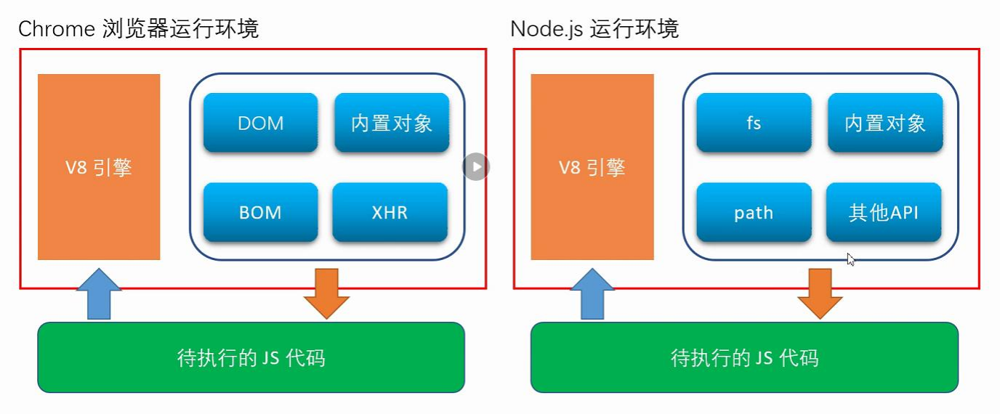
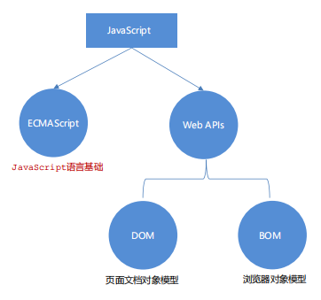

[TOC]

## 一、入门

### 什么是JavaScript

JavaScript 是一种脚本语言，是一种动态语言，是一种解释型语言，是一种弱类型语言，是一种跨平台语言

### JavaScript的由来

### JavaScript的特点

### JavaScript与EcmaScript、TypeScript的区别

### JavaScript可以做什么

- 网页特效 (监听用户的一些行为让网页作出对应的反馈) 
- 表单验证 (针对表单数据的合法性进行判断)
- 数据交互 (获取后台的数据, 渲染到前端) 
- 服务端编程 (node.js)

### JavaScript分为哪个几部分




- ECMAScript（规定了js基础语法核心知识）
- DOM（操作文档）
- BOM（操作浏览器）
 
### 注意

1. 严格区分大小写
2. 空格、换行、缩进不敏感
3. 分号可省略

### JavaScript引入方式

1. 内联式
2. 行内式
3. 引入式

> 不需要提前执行的代码放在\<body>底部
> async: 异步加载，不阻塞页面加载，下载完再执行
> defer: 延迟加载，先下载，网页加载完再执行

## 二、基本语法

### 1.变量


#### 基本概念

| 名称             | 作用                           |
| ---------------- | ------------------------------ |
| 变量          | 变量是存储数据的容器                     |
| 数组       |  存储多个数据的容器                     |
| const | 常量，不允许重新赋值                     |
| let  | 块级作用域，只在{}中有效，不支持重名       |
| var  | 全局作用域，支持重名，不建议使用           |


#### 关键字

|       关键字       |                            |
| ---------------- | ------------------------------ |
| break          | const                     |


### 2.数据类型


#### 数据类型分类

- 基本数据类型
  - number 数字型
  - string 字符串型
  - boolean 布尔型
  - undefined 未定义型
  - null 空类型
- 引用数据类型
  - Object

> NaN 非数字型

#### undefined和null的区别

undefined是只声明，不赋值，说明值没传过来
null是赋值了，但值为空，说明还不知到放什么，先放个null

#### 特殊字符

| 字符             | 含义                           |
| ---------------- | ------------------------------ |
| \0        | Null                     |


#### 数据类型检测

typeof关键字

```
let name = 'hello';
console.log(typeof name);
```

#### 数据类型转换

boolean类型转换

| 数据类型 | true       | false  |
| -------- | ---------- | ------ |
| boolean  | true       | false  |
| string   | 非空字符串 | 空     |
| number   | 非零数值   | 0、NaN |


#### 数字型-算数优先级

先括号，再乘除取余，后加减

#### 字符型-模板字符串

反引号+${}

```
`${}`
```


### 3.表达式


### 4.运算符


### 5.运算符


### 6.流程控制


### 报错信息

#### 语法错误

报错：

原因：常量不允许重新赋值

#### 运行错误


### 常用语句

| 语句             | 功能                           |
| ---------------- | ------------------------------ |
| alert()          | 弹出对话框                     |
| console.log()    | 打印到控制台                   |
| prompt()         | 弹出对话框，返回用户输入的值   |
| confirm()        | 弹出对话框，返回用户点击的按钮 |
| setInterval()    | 定时器                         |
| setTimeout()     | 定时器                         |
| document.write() | 向页面写入内容                 |


## 三、数组

### 1.创建数组

#### 使用new Array() 创建数组

```
  // 元素值类型为字符型
  var area = new Array('Beijing', 'Shanghai', 'Shenzhen');
  // 元素值类型为数值型
  var score = new Array(56, 68, 98, 44);
  // 元素值类型为混合型
  var mix = new Array(123, 'abc', null, true, undefined);
  // 空数组
  var arr1 = new Array();  // 或 var arr2 = new Array;
```

#### 使用 [ ] 创建数组

```
var weather = ['wind', 'fine',];      // 相当于：new Array('wind', 'fine',)
var empty = [];                       // 相当于：new Array
var mood = ['sad', , , ,'happy'];     // 控制台输出mood：(5) ["sad", empty × 3, "happy"]
```

### 2.操作数组
#### 获取数组长度
使用.length

```
var arr1 = [78, 88, 98];
var arr2 = ['a', , , , 'b', 'c'];
console.log(arr1.length);   // 输出结果为：3
console.log(arr2.length);   // 输出结果为：6
```

#### 设置数组长度
使用.length并初始化
大于留空
小于删除
 
```
var arr1 = [];
arr1.length = 5;
console.log(arr1);      // 输出结果：(5) [empty × 5]
var arr2 = [1, 2, 3];
arr2.length = 4; 
console.log(arr2);      // 输出结果：(4) [1, 2, 3, empty]
var arr3 = ['a', 'b'];
arr3.length = 2; 
console.log(arr3);      // 输出结果：(2) ["a", "b"]
var arr4 = ['hehe', 'xixi', 'gugu', 'jiujiu'];
arr4.length = 3; 
console.log(arr4);      // 输出结果：(3) ["hehe", "xixi", "gugu"]
```

#### 遍历数组
for in 循环
```
var navlistArr = ['首页','新闻','关于'];
var str = '<ul>';
for(var i in navlistArr){
    str += '<li><a>'+ navlistArr[i] +'</a></li>';
}
str += '</ul>';
document.getElementById('navlist').innerHTML = str;
```

### 3.操作元素

使用 数组名\[下标]的方式

#### 增加元素

```
// 为空数组添加元素
var height = [];
height[5] =  183;
height[0] =  175;
height[3] =  150;
console.log(height);      // 输出结果：(6) [175, empty × 2, 150, empty, 183]

// 为非空数组添加元素
var arr = ['Asa', 'Taylor'];
arr[2] = 'Tom';
arr[3] =  'Jack';
console.log(arr);         // 输出结果：(4) ["Asa", "Taylor", "Tom", "Jack"]
```

#### 删除元素

delete 数组名\[下标]
删除后依旧占用空间

```
var stu = ['Tom', 'Jimmy', 'Lucy'];
console.log(stu);     // 输出结果：(3) ["Tom", "Jimmy", "Lucy"]
delete stu[1];        // 删除数组中第2个元素
console.log(stu);     // 输出结果：(3) ["Tom", empty, "Lucy"]
```

#### 修改元素

```
var arr = ['a', 'b', 'c', 'd'];
arr[2] = 123;
arr[3] = 456;
console.log(arr);         // 输出结果：(4) ["a", "b", 123, 456]
```

解构赋值
```
// 传统方式
var arr = [1, 2, 3];
var a = arr[0];
var b = arr[1];
var c = arr[2];

// ES6解构赋值
var arr = [1, 2, 3];
[a, b] = arr;
console.log(a + ' - ' + b);     // 输出结果：1 - 2
var n1 = 4, n2 = 8;
[n1, n2] = [n2, n1];
console.log(n1 + ' - ' + n2);   // 输出结果：8 - 4
```


#### 查找数组

```
var arr = ['hello', 'JavaScript', 22.48, true];
console.log(arr[0]);
console.log(arr[2]);
console.log(arr);
```

### 4.数组属性与方法


### 5.MAP集合


### 6.set集合


### 7.迭代器


## 四、函数

#### 作用域
函数是一个基本作用域

#### 预解析


#### 变量提升

变量提升到最上面
作用域才提升

## 五、对象

## 六、BOM

## 七、DOM

#### 定时器

轮循定时器

```
setInterval(function(){},1000)
```

延迟定时器

```
setTimeout(function(){},1000)
```

## 八、事件


## 九、正则表达式


| 正则表达式                                         | 说明                                                | 示例                                                   |
| -------------------------------------------------- | --------------------------------------------------- | ------------------------------------------------------ |
| `^`                                                | 匹配字符串的开始位置                                | `^abc` 只匹配以 "abc" 开始的字符串                     |
| `$`                                                | 匹配字符串的结束位置                                | `abc$` 只匹配以 "abc" 结束的字符串                     |
| `.`                                                | 匹配除换行符以外的任何单个字符                      | `a.b` 匹配所有形如 "axb" 的字符串，其中 x 是任意字符   |
| `\d`                                               | 匹配数字字符（等价于 `[0-9]`）                      | `\d+` 匹配一个或多个连续的数字                         |
| `\D`                                               | 匹配非数字字符                                      | `\D+` 匹配一个或多个连续的非数字字符                   |
| `\w`                                               | 匹配字母、数字、下划线（等价于 `[a-zA-Z0-9_]`）     | `\w+` 匹配一个或多个连续的字母、数字或下划线           |
| `\W`                                               | 匹配非字母、数字、下划线                            | `\W+` 匹配一个或多个连续的非字母、非数字或非下划线字符 |
| `\s`                                               | 匹配空白字符（包括空格、制表符、换页符等）          | `\s+` 匹配一个或多个连续的空白字符                     |
| `\S`                                               | 匹配非空白字符                                      | `\S+` 匹配一个或多个连续的非空白字符                   |
| `[abc]`                                            | 匹配字符 a、b、c 中的任意一个                       | `[abc]+` 匹配一个或多个连续的 a、b 或 c 字符           |
| `[^abc]`                                           | 匹配非字符 a、b、c 中的任意一个                     | `[^abc]+` 匹配一个或多个连续的非 a、非 b 或非 c 字符   |
| `[a-z]`                                            | 匹配字符 a 到 z 之间的任意字符                      | `[a-z]+` 匹配一个或多个连续的小写字母                  |
| `[a-zA-Z]`                                         | 匹配字符 a 到 z 或 A 到 Z 之间的任意字符            | `[a-zA-Z]+` 匹配一个或多个连续的大写或小写字母         |
| `[0-9]`                                            | 匹配数字 0 到 9 之间的任意字符                      | `[0-9]+` 匹配一个或多个连续的数字                      |
| `\b`                                               | 匹配单词边界                                        | `\bword\b` 只匹配完整的单词 "word"                     |
| `\B`                                               | 匹配非单词边界                                      | `\Bword\B` 匹配嵌入在其他字符中的 "word"               |
| `^\w{6,12}$`                                       | 匹配长度为 6 到 12 位的字母、数字或下划线组成的密码 | `"abc123"`、`"password"`                               |
| `^\d{6}$`                                          | 匹配长度为 6 位的数字组成的密码                     | `"123456"`                                             |
| `^\d{18}$`                                         | 匹配长度为 18 位的身份证号码                        | `"123456789012345678"`                                 |
| `^\d{15}$`                                         | 匹配长度为 15 位的旧版身份证号码                    | `"123456789012345"`                                    |
| `^[a-zA-Z0-9._%+-]+@[a-zA-Z0-9.-]+\.[a-zA-Z]{2,}$` | 匹配标准的电子邮件地址                              | `"example@example.com"`                                |
| `^\+\d{1,3}\d{10,15}$`                             | 匹配带国家区号的电话号码                            | `"+8613800138000"`                                     |
| `^\d{3}-\d{3}-\d{4}$`                              | 匹配美国电话号码格式                                | `"123-456-7890"`                                       |
| `^\d{3}-\d{8}$`                                    | 匹配中国大陆固定电话号码格式                        | `"010-12345678"`                                       |
| `^\d{11}$`                                         | 匹配中国大陆手机号码格式                            | `"13800138000"`                                        |
| `^\d{5}(?:[-\s]\d{4})?$`                           | 匹配美国邮政编码格式                                | `"12345"`、`"12345-6789"`                              |
| `^\d{6}$`                                          | 匹配中国邮政编码格式                                | `"100000"`                                             |
| `^(http                                            | https)://[a-zA-Z0-9.-]+(?:/[a-zA-Z0-9._-]*)*$`      | 匹配标准的 URL 地址                                    | `"http://www.example.com"` |


## 十、Ajax

## 十一、jQuery


## 参考资料

[1] [仿王者荣耀首页](https://blog.csdn.net/html_wangye/article/details/126169574)

