# 前端项目实战

## 前言

记录我的前端学习项目经验

## HTML篇

### 案例一：招聘信息

效果：

预览：

<a href="https://htmlpreview.github.io/?https://github.com/0science/qianduan/blob/master/HTML/01/news.html">点我查看</a>

---

### 案例二：

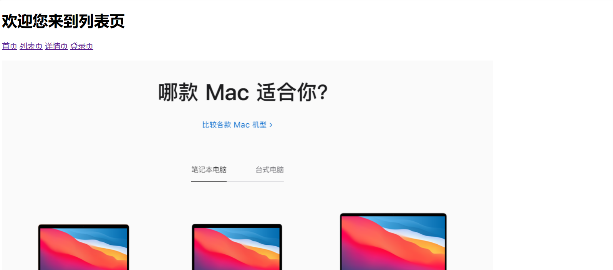
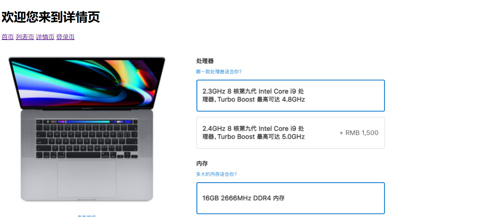
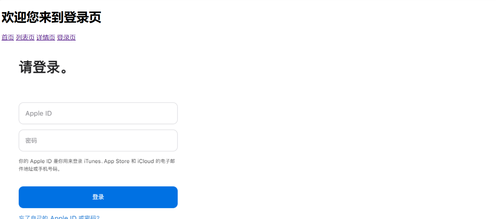

预览：

<a href="https://htmlpreview.github.io/?https://github.com/0science/qianduan/blob/master/HTML/02/index.html">点我查看</a>

### 案例三：表格布局——课程表

### 案例四：表单布局——信息表

### 案例五：框架布局——网页嵌套

## JavaScript

### 控制台输出
需求：
1. 声明一个变量，用于存放用户购买的商品 数量 ( num ) 为 20 件
2. 声明一个变量，用于存放用户的 姓名 ( uname ) 为 ’张三’
3. 依次控制台打印输出两个变量

效果：
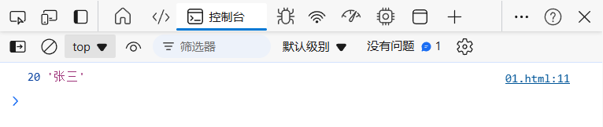

### 弹出姓名
需求： 
1. 浏览器中弹出对话框： 请输入姓名， 
2. 页面中输出：刚才输入的姓名

效果：
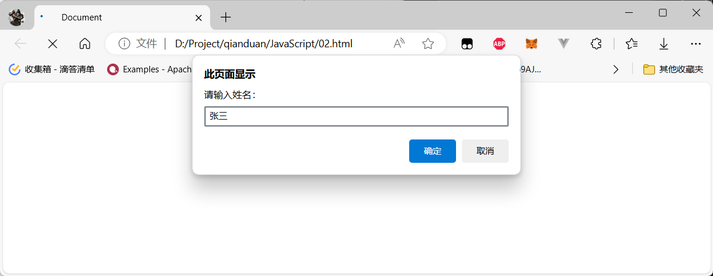

### 交换变量的值
需求：
1. 有2个变量： num1 里面放的是 10， num2 里面放的是20
2. 最后变为 num1 里面放的是 20 ， num2 里面放的是 10

效果：
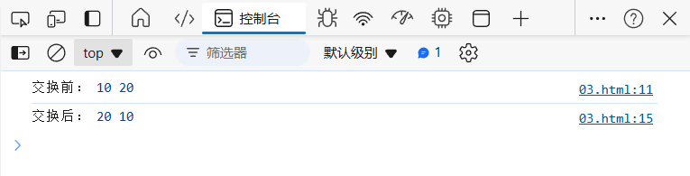

### 输出用户信息
需求：
1. 让用户输入自己的名字、年龄、性别
2. 再输出到网页

效果：
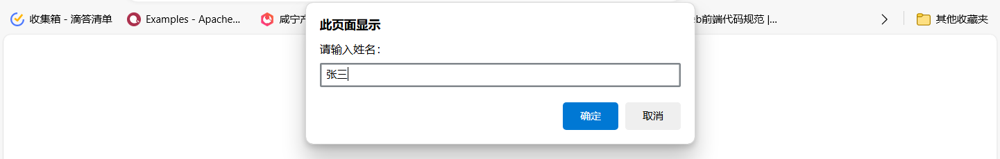
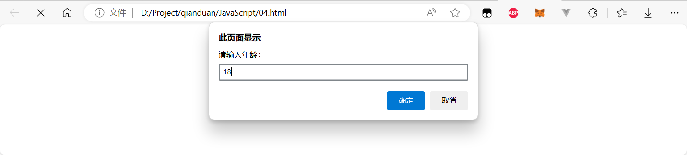
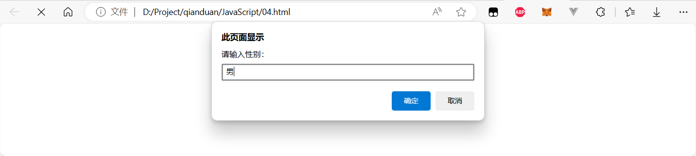
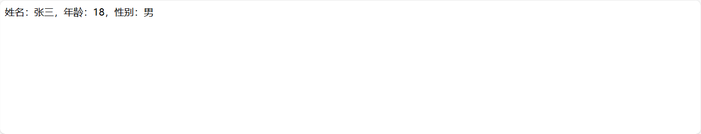

### 数组取值
需求：
1. 定义一个数组，里面存放星期一、星期二…… 直到星期日（共7天）
2. 在控制台输出：星期日

效果：
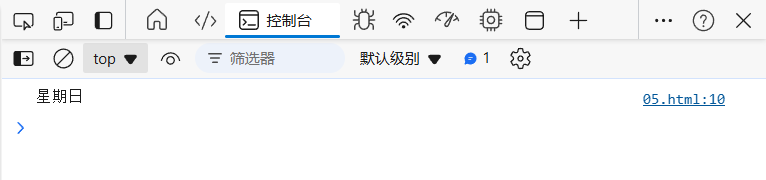

### 计算圆的面积
需求：
1. 对话框中输入圆的半径，
2. 算出圆的面积并显示到页面

效果：
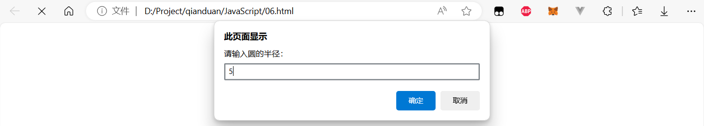

### 输出用户信息案例
需求：
1. 页面弹出对话框，输入名字和年龄
2. 页面显示： 大家好，我叫xxx，今年xx岁了

效果：

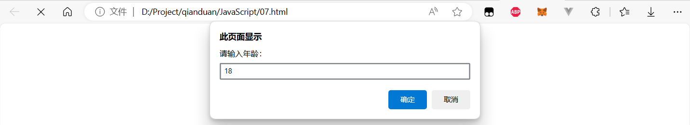
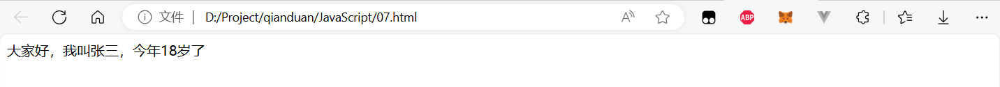

### 输入两数求和
需求：
1. 输入2个数，计算两者的和
2. 打印到页面中

效果：
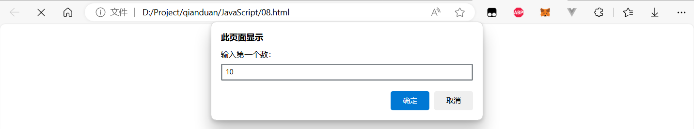
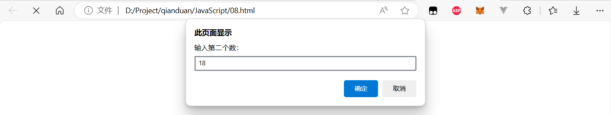
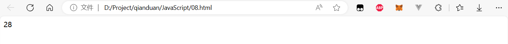

### 用户订单信息
需求：
1. 输入商品的名称、价格、数量和收货地址
2. 自动打印订单信息

效果：
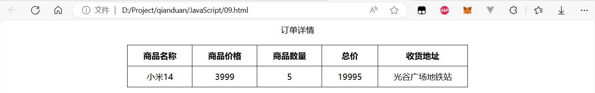

### 判断一个数是4的倍数，且不是100的倍数
需求：
1. 用户输入一个数
2. 判断这个数能被4整除，但是不能被100整除
3. 满足条件，页面弹出true，否则弹出false

效果：
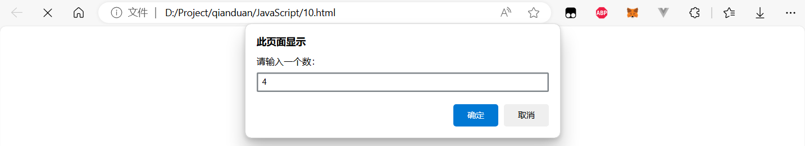

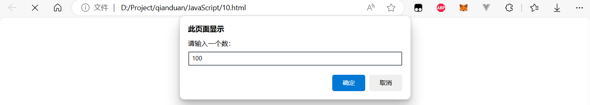
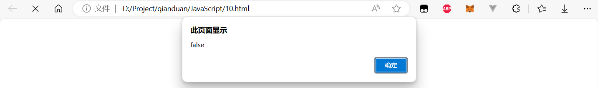

### 单分支判断
需求：
1. 用户输入成绩
2. 如果分数大于60，则提示恭喜及格
3. 则提示抱歉，不及格

效果：
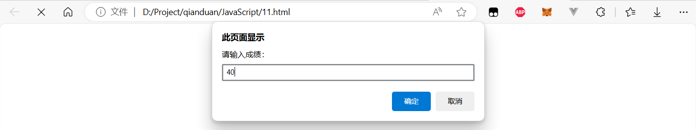
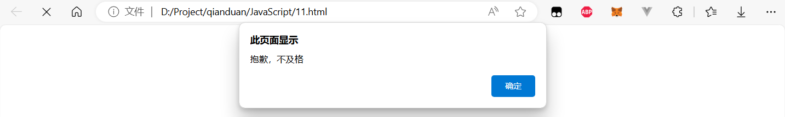
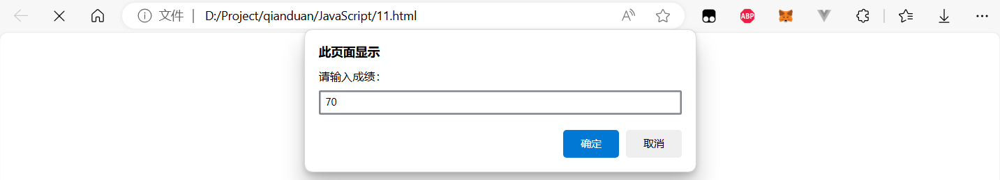
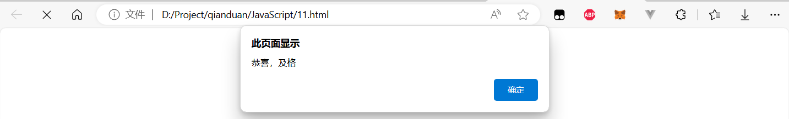

### 判断用户登录
需求：
1. 用户输入，
2. 用户名：pink，密码：123456， 则提示登录成功
3. 否则提示登录失败

