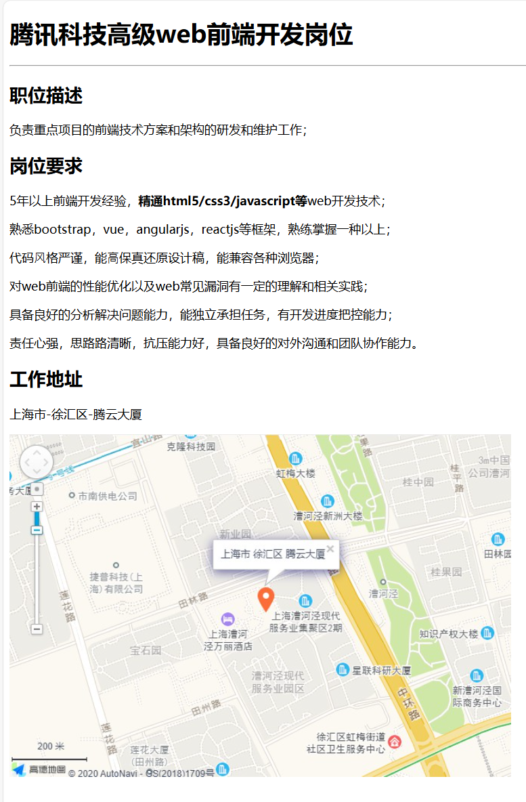
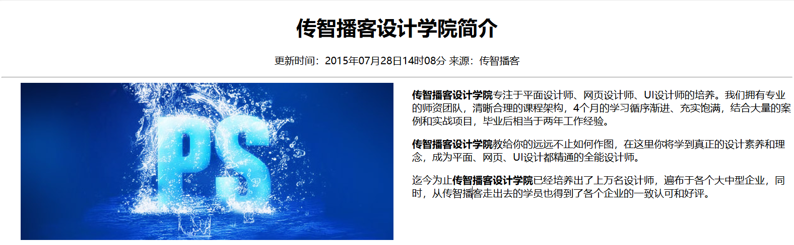
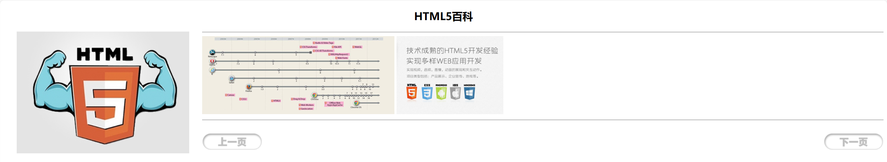
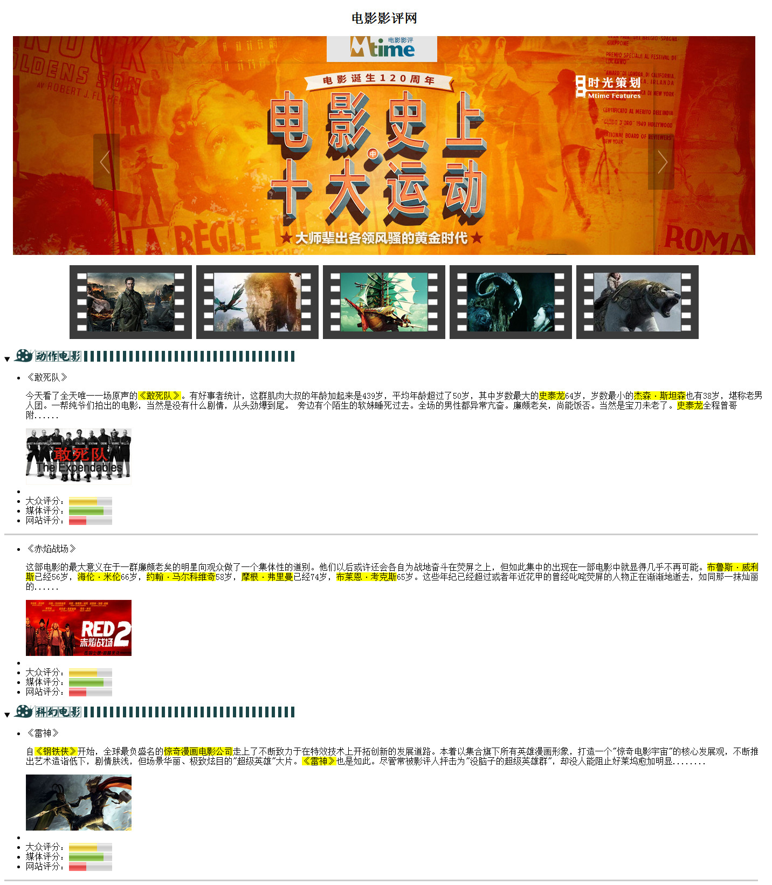
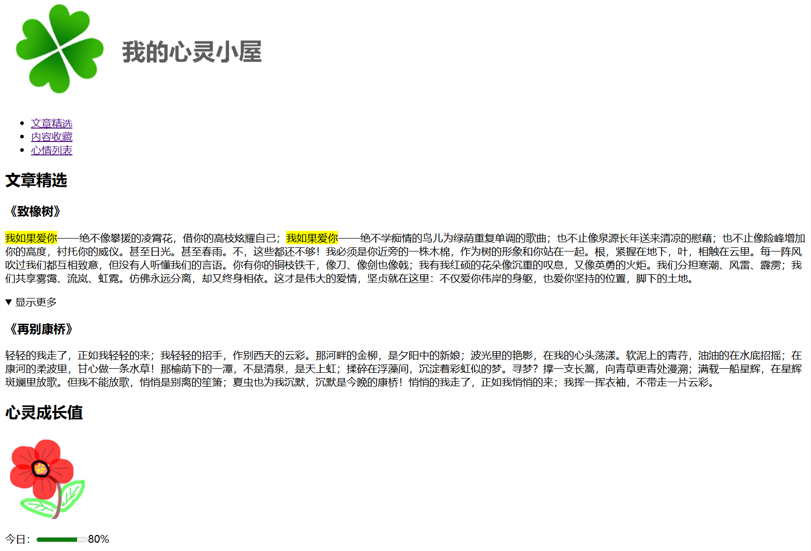
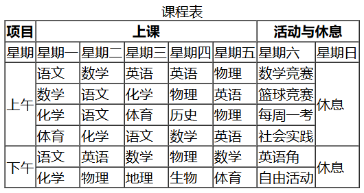
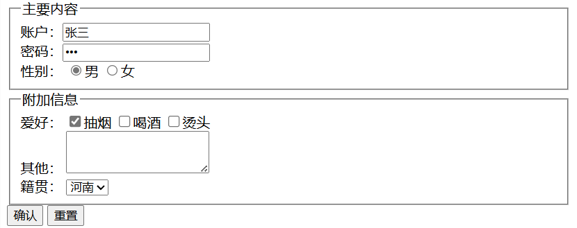
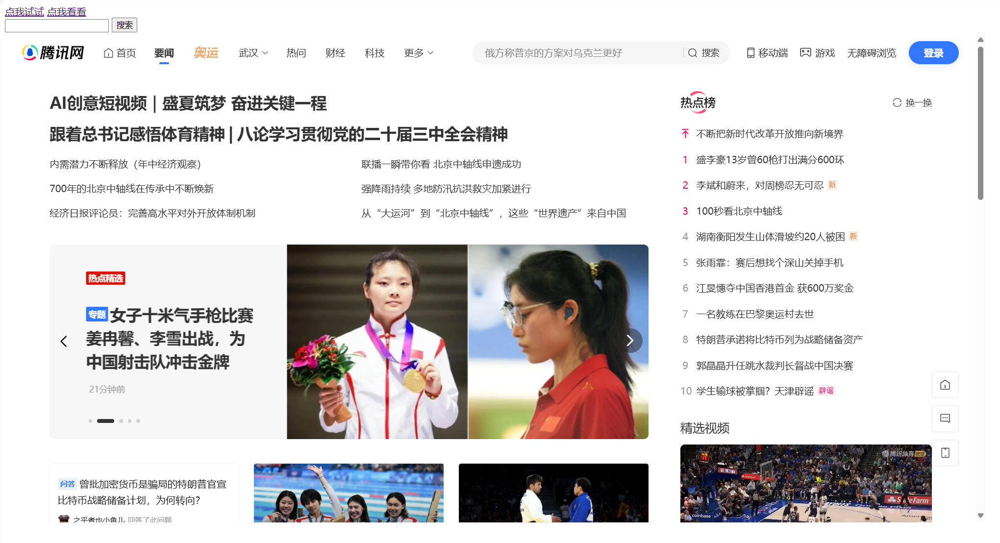
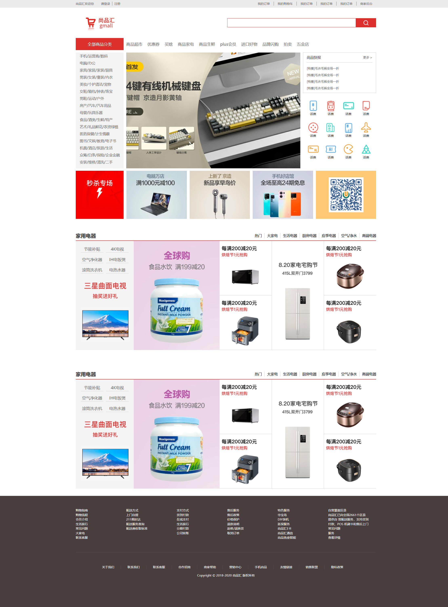
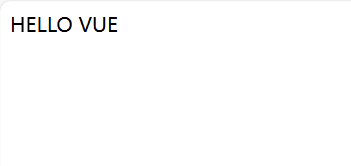

# 前端实战案例

[TOC]

## 0.前言

此项目用于记录我的前端学习途中的实战项目

## 1.HTML与CSS基础

### 1.1 图文布局

#### 1.1.1 新闻页面 

#### 1.1.2 简介信息

#### 1.1.3 产品介绍页跳转

### 1.2 列表布局

#### 1.2.1 电影影评网

#### 1.2.2 心灵小屋美文

#### 1.2.3 课程表

#### 1.2.4 表单信息填写

#### 1.2.5 信息登记表（待补充）

### 1.3 风格样式

#### 1.3.1 字体广告

### 1.4 多媒体

#### 1.4.1网页嵌套

### 1.5 布局

#### 1.5.1 浮动布局

### 1.6 项目实战

####  1.6.1尚品汇首页

## 3.vue基础

### 3.1 vue语法

#### 3.1.1  HELLO VUE

#### 3.1.2  VUE数据绑定

