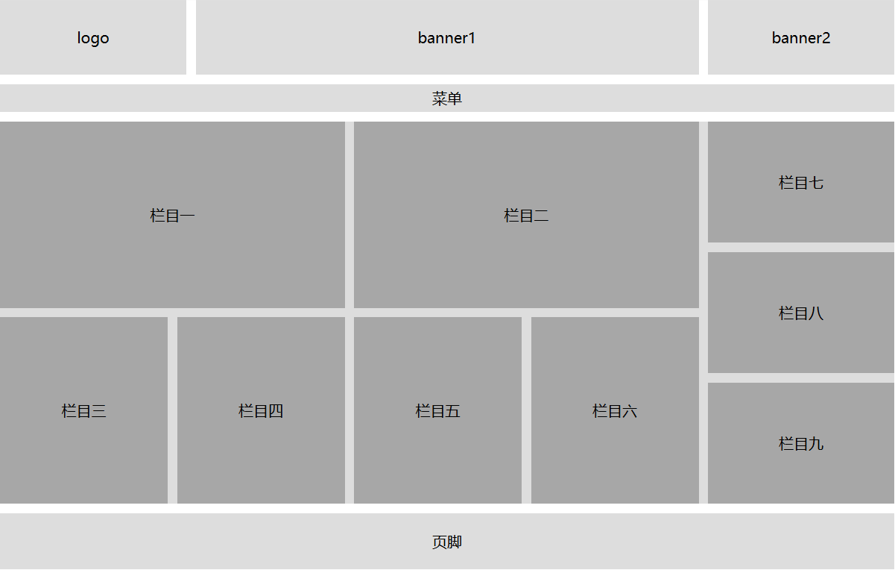
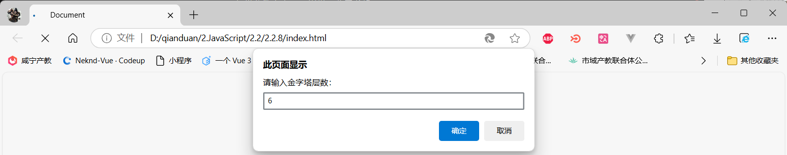

# 前端实战案例

[TOC]

## 0.前言

此项目用于记录我的前端学习途中的实战项目

## 1.HTML与CSS基础

### 1.1 图文布局

#### 1.1.1 新闻页面 

#### 1.1.2 简介信息

#### 1.1.3 产品介绍页跳转

### 1.2 列表布局

#### 1.2.1 电影影评网

#### 1.2.2 心灵小屋美文

#### 1.2.3 课程表

#### 1.2.4 表单信息填写

#### 1.2.5 信息登记表（待补充）

### 1.3 风格样式

#### 1.3.1 字体广告

### 1.4 多媒体

#### 1.4.1网页嵌套

### 1.5 布局

#### 1.5.1 浮动布局

### 1.6 项目实战

####  1.6.1尚品汇首页

## 2.JavaScript

### 2.1 快速入门

#### 2.1.1 控制台输出

#### 2.1.2 弹出对话框
需求： 
1. 浏览器中弹出对话框： 请输入姓名， 
2. 页面中输出：刚才输入的姓名

效果：

#### 2.1.3 交换变量的值
需求：
1. 有2个变量： num1 里面放的是 10， num2 里面放的是20
2. 最后变为 num1 里面放的是 20 ， num2 里面放的是 10

效果：

#### 2.1.4 输出用户信息
需求：
1. 让用户输入自己的名字、年龄、性别
2. 再输出到网页

效果：

### 2.2 基本语法

#### 2.2.1 计算圆的面积
需求：
1. 对话框中输入圆的半径，
2. 算出圆的面积并显示到页面

效果：

#### 2.2.2 输出用户信息案例
需求：
1. 页面弹出对话框，输入名字和年龄
2. 页面显示： 大家好，我叫xxx，今年xx岁了

效果：

#### 2.2.3 输入两数求和
需求：
1. 输入2个数，计算两者的和
2. 打印到页面中

效果：

#### 2.2.4 用户订单信息
需求：
1. 输入商品的名称、价格、数量和收货地址
2. 自动打印订单信息

效果：

>

#### 2.2.5 判断一个数是4的倍数，且不是100的倍数
需求：
1. 用户输入一个数
2. 判断这个数能被4整除，但是不能被100整除
3. 满足条件，页面弹出true，否则弹出false

效果：

#### 2.2.6 单分支判断
需求：
1. 用户输入成绩
2. 如果分数大于60，则提示恭喜及格
3. 则提示抱歉，不及格

效果：

#### 2.2.7 判断用户登录

#### 2.2.8 打印金字塔

#### 2.3.9 九九乘法表

### 2.3 数组

#### 2.3.1 数组遍历

#### 2.3.2 查找最值

#### 2.3.3 二维数组转置

#### 2.3.4 猴子选大王

#### 2.3.5 省市联选器

### 2.4 函数

### 2.5 对象

### 2.6 BOM

### 2.7 DOM

### 2.8 事件

### 2.9正则表达式

### 2.10 Ajax

### 2.10 jQuery

### 2.11 ES6

## 3.vue基础

### 3.1 vue语法

#### 3.1.1  HELLO VUE

#### 3.1.2  VUE数据绑定

