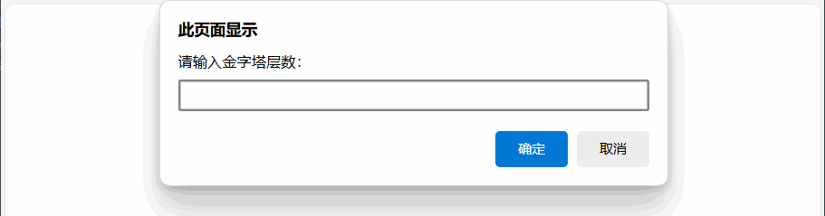
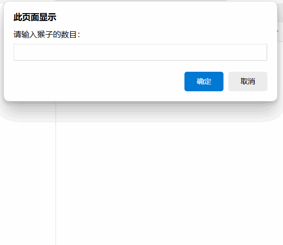

[toc]

## JavaScript实战案例

### 输出hello world

既在页面中输出hello world，也在控制台输出hello world

[输出hello world](./code/hello.html)


```
<!DOCTYPE html>
<html lang="zh-CN">
<head>
    <meta charset="UTF-8">
    <title>hello world</title>
</head>
<body>
    <script>
        document.write('hello world') // 输出到页面
        console.log('hello world') // 输出到控制台
    </script>
    </script>
</body>
</html>
```

### 改变网页背景色

点击按钮改变背景颜色

[改变网页背景色](./code/backgroundcolor.html)

```
<!DOCTYPE html>
<html lang="zh-CN">
<head>
    <meta charset="UTF-8">
    <title>改变网页背景色</title>
    <script>
        function changeColor(str){
            document.body.style.backgroundColor = str;
        }
    </script>
</head>
<body>
    <input type="button" value="红色" onclick="changeColor('red')" />
    <input type="button" value="蓝色" onclick="changeColor('blue')" />
    <input type="button" value="黑色" onclick="changeColor('black')" />
</body>
</html>
```

### 计算圆的周长和面积

对话框中输入圆的半径，算出圆的面积并显示到页面

[计算圆的周长和面积](./code/circle.html)

```
<!DOCTYPE html>
<html lang="zh-CN">
<head>
    <meta charset="UTF-8">
    <title>计算圆的面积</title>
</head>
<body>
    <script>
        let r = prompt('请输入圆的半径：')
        let s = Math.PI*r*r
        document.write('圆的面积是：',s.toFixed(2))
    </script>
</body>
</html>
```

### 打印金字塔

用户输入一个数字，打印出对应层数的金字塔

[打印金字塔](./code/pyramid.html)

```
<!DOCTYPE html>
<html lang="zh-CN">
<head>
    <meta charset="UTF-8">
    <title>Document</title>
</head>
<body>
    <script>
        var level = prompt('请输入金字塔层数：');
        // 判断是否为数字
        level = parseFloat(level) && Number(level);
        //判断输入是否合法
        if(isNaN(level) || level <= 0){
            alert('金字塔的层数必须是正整数')
        };
        //遍历金子塔层数
        for(var i = 1;i <= level;i++){
            //打印空格
            var blank = level -i;
            for(var j=1;j<=blank;j++){
                document.write('&nbsp;')            
            }
            //打印星星
            var star = 2*i-1
            for(var k=1;k<=star;k++){
                document.write('*');
            }
            document.write('<br>');
        }
    </script>
</body>
</html>
```

### 九九乘法表
打印乘法表和表格


```
<!DOCTYPE html>
<html lang="zh-CN">
<head>
    <meta charset="UTF-8">
    <title>Document</title>
</head>
<body>
    <div id="table"></div>
    <script>
        var str = '<table>';
        for(var i = 1;i<10;i++){
            str += '<tr>';
            for(var j=1;j<=i;j++){
                str += `<td>${j}*${i}=${i*j}</td>`
            }
            str += '</tr>'
        }
        str +='</table>'
        document.getElementById('table').innerHTML = str;
    </script>
    <style>
        table{
            border-collapse: collapse
        }
        td{
            border: 1px solid #000;
        }
    </style>
</body>
</html>
```


### 查找最值


```
<!DOCTYPE html>
<html lang="zh-CN">

<head>
    <meta charset="UTF-8">
    <title>查找最值</title>
</head>

<body>
    <script>
        // 假设数据
        var arr = [100, 7, 56, 150, 37, 5];
        var max = min = arr[0];
        // 查找最大值
        for (var i = 0; i < arr.length; i++) {
            if (arr[i] > max) {
                max = arr[i];
            }
            if (arr[i] < min) {
                min = arr[i];
            }
        }
        document.write("最大值：" + max + "<br>");
        document.write("最小值：" + min);
    </script>
</body>

</html>
```

### 二维数组转置

将二维数组的行和列互换，输出到页面或者命令行

[二维数组转置](./code/transpose.html)

```
<!DOCTYPE html>
<html lang="zh-CN">

<head>
    <meta charset="UTF-8">
    <title>二维数组转置</title>
</head>

<body>
    <script>
        var arr = [[1, 2, 3], [4, 5, 6], [7, 8, 9]];
        console.log(arr);
        document.write(arr[0] + '<br>');
        document.write(arr[1] + '<br>');
        document.write(arr[2] + '<br>');
        document.write('<br>');
        // 定义一个空数组
        var res = [];
        for (var i = 0; i < arr[0].length; i++) {
            // 数组赋值
            res[i] = [] 
            for (var j = 0; j < arr.length; j++) {
                // 数组交换
                res[i][j] = arr[j][i];
            }
        }
        document.write(res[0] + '<br>');
        document.write(res[1] + '<br>');
        document.write(res[2] + '<br>');
        console.log(res);
    </script>
</body>

</html>
```

### 冒泡排序

将数组的元素按从小到大的顺序排序

[冒泡排序](./code/bubble.html)

```
<!DOCTYPE html>
<html lang="zh-CN">
<head>
    <meta charset="UTF-8">
    <meta name="viewport" content="width=device-width, initial-scale=1.0">
    <title>冒泡排序</title>
</head>
<body>
    <script>
        var arr = [10,2,35,12,27,98,21];
        document.write(arr + '<br>'); 
        //确定定循环次数
        for(var i=0;i<arr.length;i++){
            //确定比较次数，每次循环比较的次数减少一个
            for(var j=0;j<arr.length -i;j++){
                //判断大小
                if(arr[j]>arr[j+1]){
                    //交换位置
                    [arr[j],arr[j+1]] = [arr[j+1],arr[j]];
                }
            }
        }
        document.write(arr);
    </script>
</body>
</html>
```

### 插入排序

将数组的元素按从小到大的顺序排序

[插入排序](./code/insertion.html)

```
<!DOCTYPE html>
<html lang="zh-CN">

<head>
    <meta charset="UTF-8">
    <title>插入排序</title>
</head>

<body>
    <script>
        var arr = [10, 2, 35, 12, 27, 98, 21];
        console.log(arr);
        //确定循环次数
        for (var i=0;i<arr.length;i++) {
            //确定比较次数，每次循环比较的次数减少一个
            for(var j=i;j>0;j--){
                if(arr[j-1]>arr[j]){
                    [arr[j-1],arr[j]] = [arr[j],arr[j-1]]
                }
            }
        }
        console.log(arr);    
    </script>
</body>

</html>
```

### 栈和队列

用数组模拟栈和队列

[栈和队列](./code/stack.html)

```
<!DOCTYPE html>
<html lang="zh-CN">
<head>
    <meta charset="UTF-8">
    <meta name="viewport" content="width=device-width, initial-scale=1.0">
    <title>栈和队列</title>
</head>
<body>
    <script>
        var stack = [1,2,3];
        var queue = ['a','b','c'];
        console.log('初始栈',stack);
        stack.push(4);
        console.log('栈(进一)',stack);
        stack.pop();
        console.log('栈(出一)',stack);
        console.log('初始队列',queue);
        queue.push('d');
        console.log('队列(进一)',queue);
        queue.shift();
        console.log('队列(出一)',queue);
    </script>
</body>
</html>
```

### 猴子选大王

从1数到m,去除m，再从1数到m，去除m，直到只剩一个，输出这个数

[猴子选大王](./code/monkey.html)

```
<!DOCTYPE html>
<html lang="zh-CN">
<head>
    <meta charset="UTF-8">
    <title>猴子选大王</title>
</head>
<body>
    <script>
        var total = prompt('请输入猴子的数目：');
        var kick = prompt('请输入踢出猴子的数字：');
        // 初始化猴子数组
        var money = [];
        for(i =0;i<total;i++){
            // 猴子数组赋值
            // 数组下标从0开始所以+1
            money.push(i+1);
        }
        console.log(money);
        // 定义一个变量记录当前数组的下标
        var index = 0;
        // 当候数组的长度大于1时循环
        while(money.length>1){
            // 猴子报数
            ++index
            // 取出数组的第一个元素
            head = money.shift();
            // 判断当前下标是否是踢出猴子的数字
            if(index%kick==0){
                console.log(head+' 出局');
            }else{
                money.push(head);
            } 
        }
        console.log('大王是：'+money[0]);
    </script>   
</body>
</html>
```

### 省市联选器

### 查找最值

将预设数组中的最大最小值输出到页面

```
<!DOCTYPE html>
<html lang="zh-CN">
<head>
    <meta charset="UTF-8">
    <title>查找最值</title>
</head>
<body>
    <script>
        // 假设数据
        var arr = [100, 7, 56, 150, 37, 5];
        var max = min = arr[0];
        // 查找最大，最小值
        for (var i = 0; i < arr.length; i++) {
            if (arr[i] > max) {
                max = arr[i];
            }
            if (arr[i] < min) {
                min = arr[i];
            }
        }
        document.write("最大值：" + max +"<br>");
        document.write("最小值：" + min);
    </script>
</body>
</html>
```

### 二维数组转置

### 冒泡排序

### 数组遍历

### 弹出对话框
需求： 
1. 浏览器中弹出对话框： 请输入姓名， 
2. 页面中输出：刚才输入的姓名

效果：


### 交换变量的值
需求：
1. 有2个变量： num1 里面放的是 10， num2 里面放的是20
2. 最后变为 num1 里面放的是 20 ， num2 里面放的是 10

效果：


### 输出用户信息
需求：
1. 让用户输入自己的名字、年龄、性别
2. 再输出到网页

效果：


### 输出用户信息案例
需求：
1. 页面弹出对话框，输入名字和年龄
2. 页面显示： 大家好，我叫xxx，今年xx岁了

效果：


### 输入两数求和
需求：
1. 输入2个数，计算两者的和
2. 打印到页面中

效果：


### 用户订单信息
需求：
1. 输入商品的名称、价格、数量和收货地址
2. 自动打印订单信息

效果：

>

### 判断一个数是4的倍数，且不是100的倍数
需求：
1. 用户输入一个数
2. 判断这个数能被4整除，但是不能被100整除
3. 满足条件，页面弹出true，否则弹出false

效果：


### 单分支判断
需求：
1. 用户输入成绩
2. 如果分数大于60，则提示恭喜及格
3. 则提示抱歉，不及格

效果：


### 判断用户登录

### 外部引用JS

### 输出转义字符

### 使用变量

### 计算本息和

### 考试是否及格

### 计算面积

### 输出古诗

### 计算税后薪资

### 2月天数


### 参考资料

[仿王者荣耀首页](https://blog.csdn.net/html_wangye/article/details/126169574)
