[TOC]

# 一、Linux部署

## 1.前置环境安装

### 1.1 下载本山海鲸查看器

下载地址：[山海鲸查看器Linux](https://www.shanhaibi.com/download#viewer)

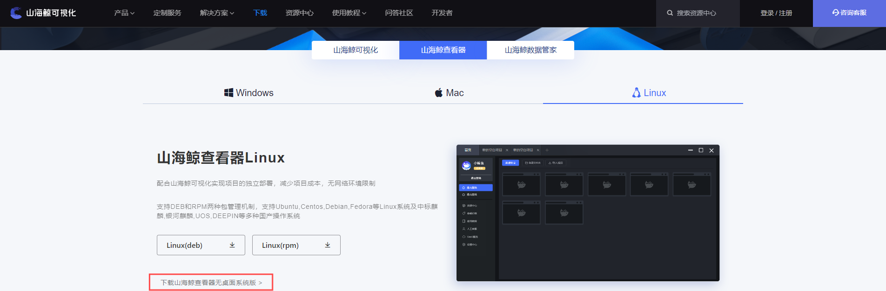

    dep最新版
    rpm稳定版

这里我下载的是无桌面的版本，得到的是一个zip的压缩包

### 1.2 连接linux服务器

通过xshell连接服务器


    主机号：110.40.49.79
    用户名：root
    密码：XIANjian4

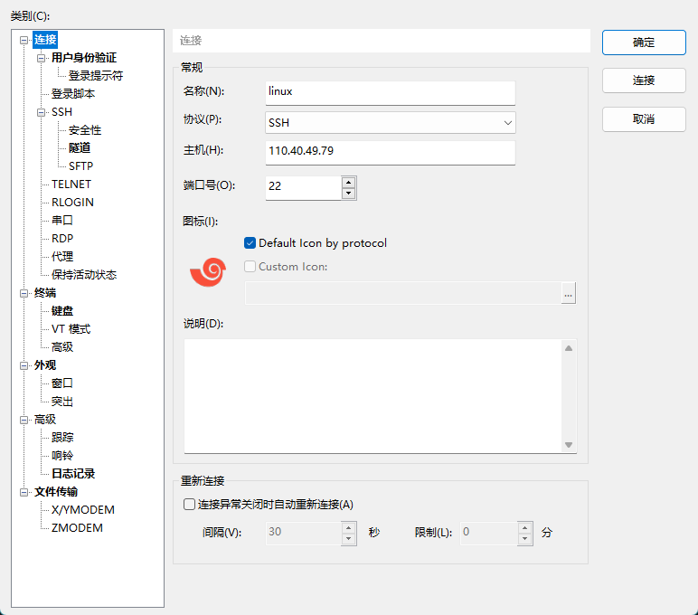


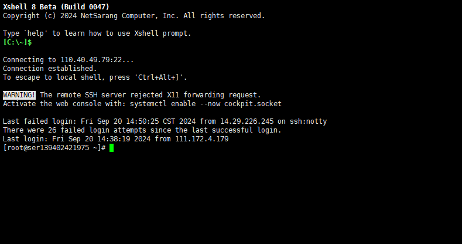

根目录下新建shanhai文件夹

```
mkdir shanhai && cd shanhai
```

通过xftp连接服务器

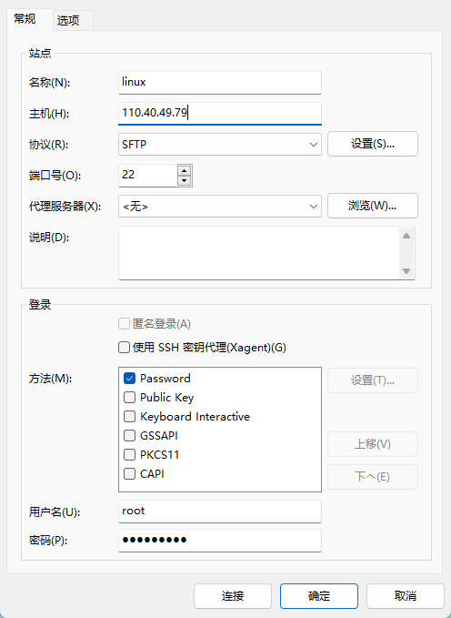

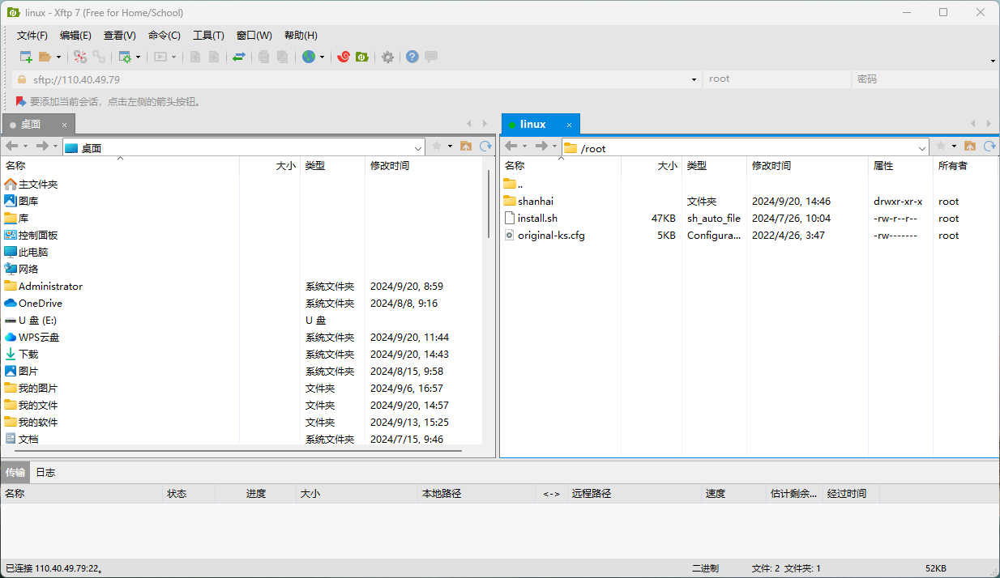

将下载好的压缩包上传到服务器

    建议上传之前将中文名称更改成英文

### 1.3 解压压缩包

```
unzip 4.3.2.zip
```

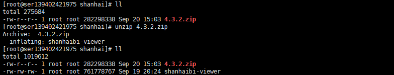

### 1.4 添加权限

```
chmod +x shanhaibi-viewer
```


### 1.5 启动软件

```
nohup ./shanhaibi-viewer &
```


如图所示则运行成功

### 1.6 查看日志

新开一个窗口

```
cat nohup.out
```

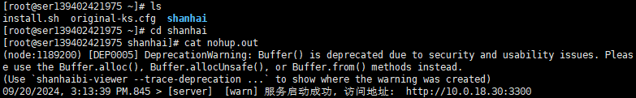

看到启动成功即可，不要访问上述地址

### 1.7 在线访问

在线访问地址：http://110.40.49.79:3300

    账号：webadmin
    密码：123456


## 2.开发环境部署

### 2.1 下载本山海鲸查看器

下载地址：[山海鲸可视化Windows](https://www.shanhaibi.com/download)


### 2.2 安装并登陆

登录账号密码

    账号：13476903245
    密码：qiami520

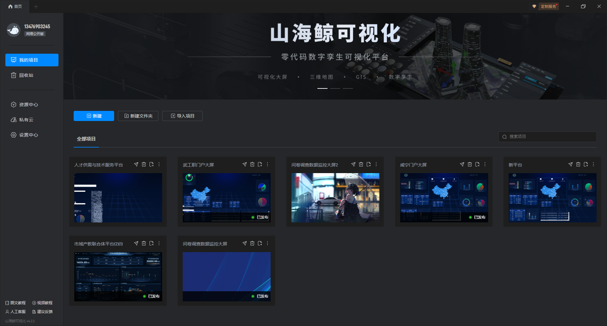

### 2.3 配置数据源

咸宁市域产教联合体

	主机号：110.42.36.3
	账号：support
	密码：XIANjian4!@#

武汉工程职业技术学院

	主机号：110.40.49.79
	账号：xianning_wgz
	密码：XIANjian4!@#

### 2.4 替换数据源

进入编辑界面


点击编辑->编辑数据

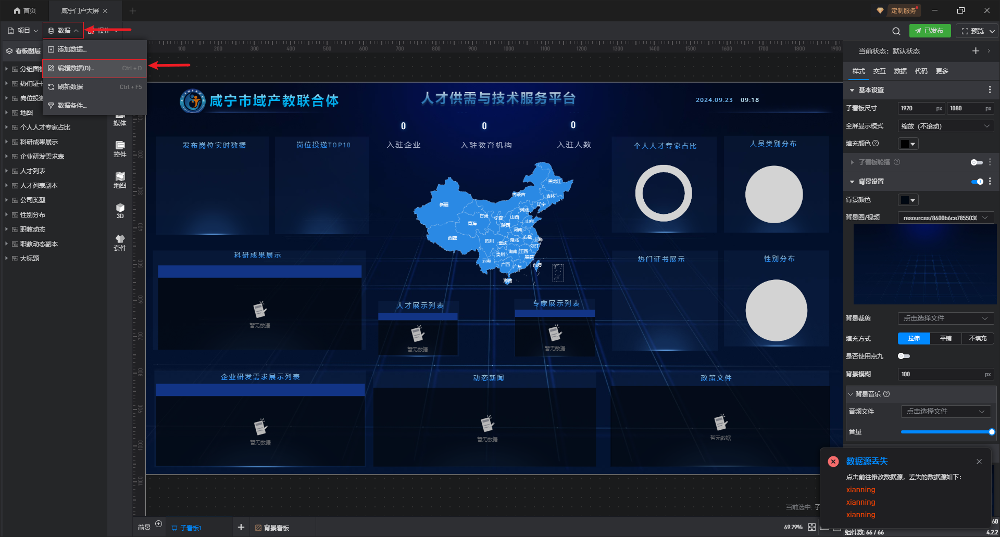

点击修改数据源

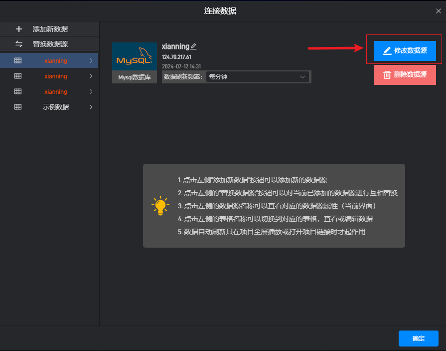

按照图上顺序依次填写

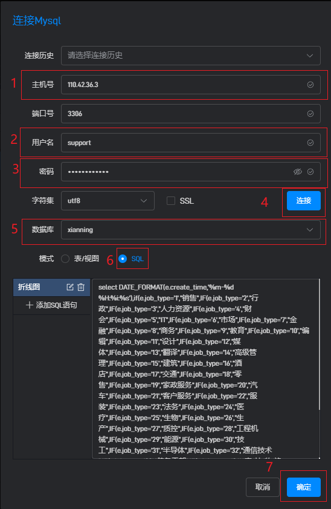

### 2.4 导出文件包

登陆山海查看器：http://110.40.49.79:3300

    账号：webadmin
    密码：123456

点击”项目码“ -> 复制未使用的项目码

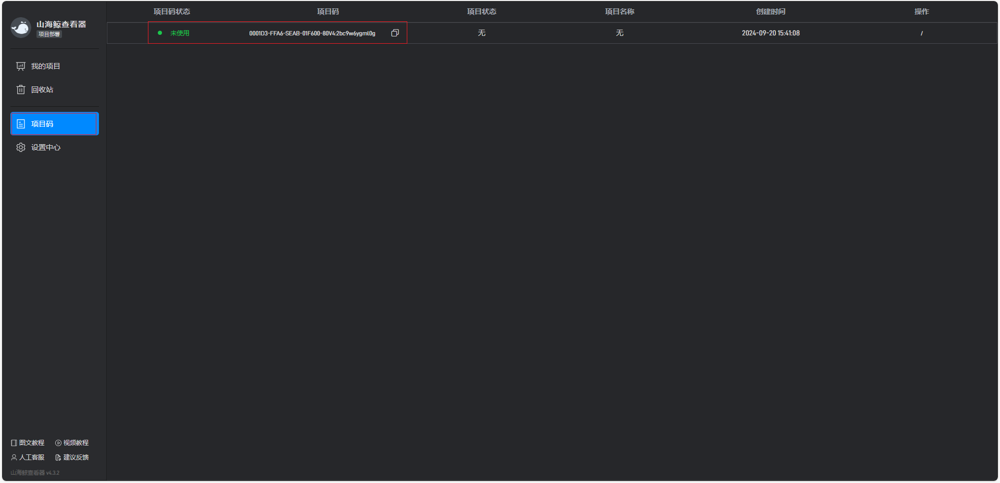

返回山海可视化，点击导出按钮


按顺序调整选项，如图所示

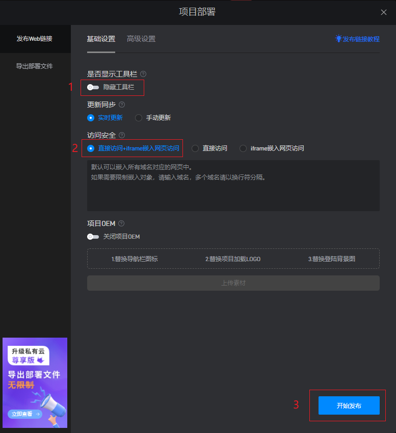

粘贴刚才复制的项目码


### 2.5 部署到服务器中

登陆山海查看器：http://110.40.49.79:3300

    账号：webadmin
    密码：123456

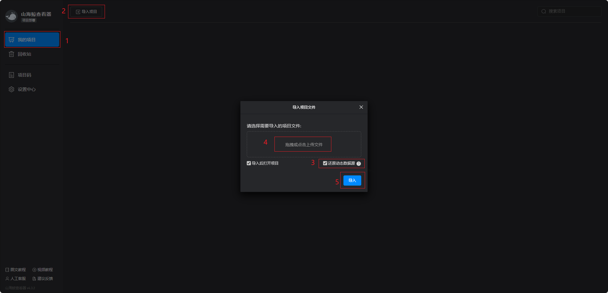

上传成功后，点击发布按钮

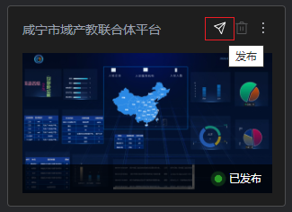

确认配置项信息是否如图所示


点击全屏查看确保显示信息无误


完成上述步骤既上传部署完成

## 3.报错修改

### 3.1 查看防火墙状态

```
systemctl status firewalld
```

